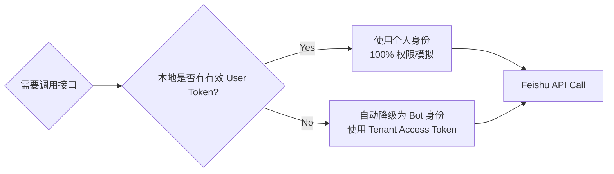

# NOS Automated Reports System Architecture

This document describes the core logic and sequential execution flow of the NOS Feishu Automation system.

---

## 📁 Core Component Overview

### 1. **feishu_streamlit_app.py** (Orchestrator)
The central command hub that provides the User Interface (UI). It triggers the entire pipeline and manages global state and status reporting.

### 2. **Feature_Case_Merging.py** (Data Engine)
The heavy-lifter responsible for local data processing. It merges raw test reports with official templates and computes pass/fail statistics.

### 3. **feishu_uploader.py** (Cloud Bridge)
A low-level SDK that handles all authenticated communication with Feishu Open APIs (Drive, Sheets, Auth). It manages token refresh logic for both User and Bot identities.

### 4. **bitable_project_tracker.py** (Tracker Sync)
A specialized module that extracts findings from generated reports and synchronizes project progress to a Feishu Bitable (Multi-dimensional table).

---

## ⏱️ Execution Sequence Diagram (时序图)

The following diagram illustrates the lifecycle of a single "One-Click Automation" execution, showing how data and control pass between different layers.

```mermaid
sequenceDiagram
    autonumber
    actor User as 用户 (User)
    participant UI as feishu_streamlit_app.py (Streamlit)
    participant Merge as Feature_Case_Merging.py (Engine)
    participant SDK as feishu_uploader.py (Auth/API)
    participant Feishu as 飞书服务器 (Feishu Cloud)
    participant Tracker as bitable_project_tracker.py (Sync)

    User->>UI: 点击 "一键执行全自动处理"
    
    rect rgb(60, 60, 60)
        Note over UI, Merge: 阶段一: 本地数据加工
        UI->>Merge: 调用 run_merge()
        Merge->>Merge: 读取本地 Input 原始文件
        Merge->>SDK: 请求下载最新在线模板 (Get Content)
        SDK->>Feishu: HTTP GET (Drive API)
        Feishu-->>SDK: 返回模板数据
        SDK-->>Merge: 模板就绪
        Merge->>Merge: 执行核心逻辑: 匹配、合并、统计
        Merge-->>UI: 完成! 生成本地 Output Excel
    end

    rect rgb(50, 70, 50)
        Note over UI, SDK: 阶段二: 云端同步与转换
        UI->>SDK: 上传本地 Excel (Upload All)
        SDK->>Feishu: HTTP POST (Drive API)
        Feishu-->>SDK: 返回 File Token
        UI->>SDK: 请求将 Excel 转换为在线表格 (Import)
        SDK->>Feishu: HTTP POST (Sheets API)
        Feishu-->>SDK: 返回 Ticket ID
        loop 轮询任务状态 (Polling)
            SDK->>Feishu: 查询导入进度
            Feishu-->>SDK: Status: Working/Success
        end
        SDK->>Feishu: 删除 Drive 里的原始临时 Excel (Delete)
        SDK-->>UI: 返回转换后的 Sheet 对外链接 (URL)
    end

    rect rgb(50, 60, 80)
        Note over UI, Tracker: 阶段三: 项目进度自动填报
        UI->>Tracker: 触发 bitable 同步
        Tracker->>Tracker: 读取 Output Excel 末行统计数字
        Tracker->>SDK: 申请/刷新 Bitable 操作凭证
        SDK->>Feishu: 获取 Access Token (User or Bot)
        SDK-->>Tracker: 凭证发放成功
        Tracker->>Feishu: 新增记录行 (Bitable API)
        Tracker->>Feishu: 更新 "本周数据" 视图过滤器 (PATCH)
        Tracker-->>UI: Bitable 同步完成
    end

    UI->>User: 释放气球 (st.balloons) & 显示预览链接
```

---

## 🔒 Authentication Fallback Logic

To ensure the app works in both **Local Development (scanning QR code)** and **Cloud Deployment (Server-side)**, the system implements an automatic authentication bridge inside `feishu_uploader.py`:

---

## 📈 Summary of Workflows

1.  **Local Mode**: User runs `feishu_auth_helper.py` once to login. The app identifies as the user.
2.  **GitHub / Cloud Mode**: User hides secrets in environment variables. The app automatically identifies as the Bot, using the shared `NOS_Automated_Reports_Bot_Owned` folder.
