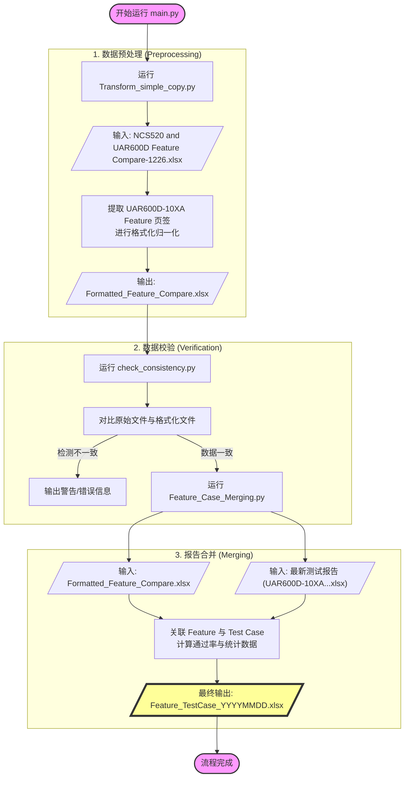

# NOS Feature & Case Toolchain Workflow

本项目通过 `main.py` 驱动一个多步骤的自动化流水线，将原始功能列表与测试报告进行关联，最终生成可视化的合并报告。

## 流程概览

## 详细步骤说明

### 1. 驱动程序 (`main.py`)
- **作用**: 流水线控制器。
- **逻辑**: 使用 `subprocess` 按序调用各个 Python 脚本，并监控执行状态。如果某步失败，流程将立即中止。

### 2. 预处理 (`Transform_simple_copy.py`)
- **输入**: `NCS520 and UAR600D Feature Compare-1226.xlsx`
- **处理**:
    - 锁定 `UAR600D-10XA Feature` 工作表。
    - 对 `描述` 列进行向下填充（ffill），确保每个功能点都有所属分类。
    - 应用特定的样式（边框、加粗、颜色）。
- **输出**: `Formatted_Feature_Compare.xlsx`

### 3. 一致性检查 (`check_consistency.py`)
- **作用**: 风险控制。
- **逻辑**: 对比原始文件和生成的格式化文件中的行数、`规格`、`UT NOS` 等关键字段，确保在转换过程中没有丢失或改动数据。

### 4. 核心合并 (`Feature_Case_Merging.py`)
- **输入**:
    - `Formatted_Feature_Compare.xlsx` (功能清单)
    - 最新日期命名的测试报告 (测试数据)
- **处理**:
    - **鲁棒读取**: 直接解析 XLSX 的 XML 结构，绕过复杂的公式和格式干扰。
    - **匹配算法**: 按照功能名称将测试用例关联到对应的 Feature。
    - **统计计算**: 自动计算每个 Section 以及全局的测试通过率 (Pass Rate) 和 CLI 覆盖率。
    - **可视化导出**: 生成带有分级折叠（Outline）、背景颜色标识、冻结窗格的 Excel 报告。
- **输出**: `Feature_TestCase_YYYYMMDD.xlsx`
